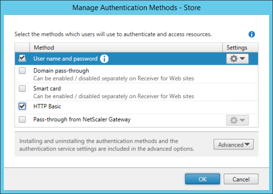
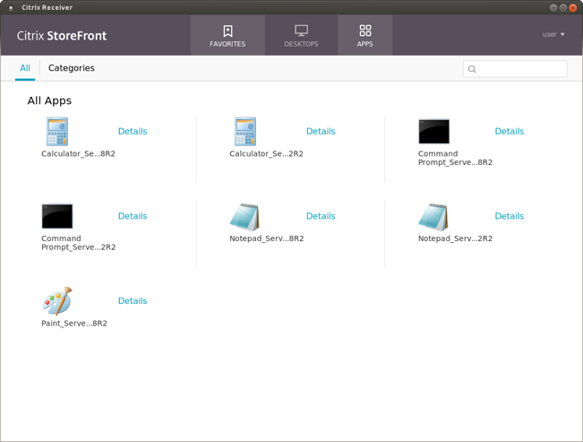

# Setting up your environment

To use the Fast Connect API you must first configure your site appropriately:
	
1. In StoreFront, enable the HTTP Basic authentication method as follows: 
2. If Citrix Receiver for Linux is running, close it.
3.	If the Authentication Manager (AM) daemon is running, terminate it.
4. Add the following key to the AM configuration file ($ICAROOT/config/AuthManConfig.xml) to allow HTTP Basic authentication, which is needed for SSO:

```
<Protocols>
	<HTTPBasic>
		<Enabled>True</Enabled>
	</HTTPBasic>
</Protocols>
```
If the protocol key is already present and configured with other protocols, add the HTTPBasic sub-key to the Protocols node.

**Note**: AM’s configuration file included with Citrix Receiver for Linux 13.10 contains an example of how to enable HTTPBasic support.

&#53;. Start Citrix Receiver for Linux.

&#54;. You can now inject a user name and password into the SSO functionality by interacting with the Fast Connect API, using the `LogonSsoUser()` function described later in this document.

&#55;. If you are prompted for an account, specify the URL for your StoreFront Service Site. A StoreFront URL looks like this: `https://SMBSZ-XENAPPS1.xa.local/Citrix/Store/discovery`

&#56;. To get the store accepted, confirm the store’s URL.

&#57;. If the credentials injected in step 6 are valid for the store you just configured, you will be immediately logged on to your account:



Receiver on the endpoint is now set up for SSO and Fast Connect API use.

&#49;&#48;. If you want to remove the credentials from SSO, use the `LogoffSsoUser()` function described in the following section.

 
